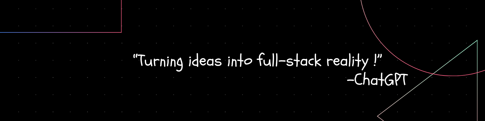

# Hey, I'm Tabish, Full Stack Developer👋🏼:

 

  
  
    

-    Join Me On Linkedin <a href="https://www.linkedin.com/in/tabish-khan-61a14124a/">**Tabish Khan**</a>
-    How to reach me <a href="mailto:tabishkhan1811@gmail.com">**tabishkhan1811@gmail.com**</a>
-    My <a href="https://tabishkhan18.github.io/">**Portfolio**</a>

<h1>🌐 Socials:</h1>

  
  
  
  
  
  

# 💻 Tech Stack:

<h1>📊 GitHub Stats:</h1>

<table align="center">
  <tr>
    <td>
      
    </td>
    <td>
      
    </td>
  </tr>
</table>

  
<!--    -->

<!-- Proudly created with GPRM ( https://gprm.itsvg.in ) -->
